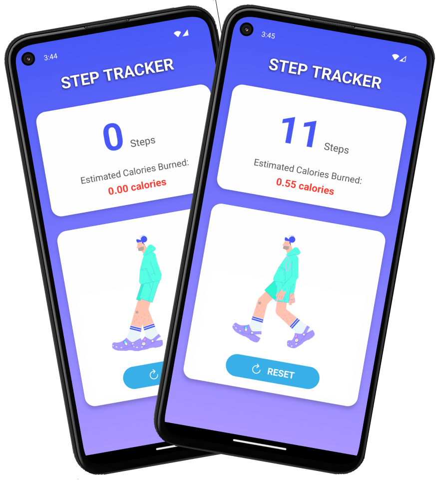

# Step Counter

**Step Counter** is a practice Android app built with React Native, using **Expo Sensors** for tracking steps. This app displays step count and estimates calories burned in a clean and visually engaging interface.


---

## 🚀 Features

- **Step Tracking:** Uses the accelerometer to detect steps.
- **Calorie Estimation:** Calculates calories burned based on steps taken.
- **Real-Time Animation:** Engaging animations using **Lottie** to visualize activity.
- **Gradient UI:** Attractive gradient background with clear and intuitive design.
- **Reset Functionality:** Quickly reset step count and start fresh.

---

## 🛠️ Technology Stack

- **React Native**: For building the app's UI and functionality.
- **Expo Sensors**: For accessing the device's accelerometer.
- **Lottie-React-Native**: For dynamic and smooth animations.
- **Expo Linear Gradient**: For creating beautiful background gradients.
- **Ionicons**: For modern and scalable vector icons.

---

## 📦 Dependencies

The following dependencies are used in the project:

```json
{
  "expo": "~47.0.0",
  "expo-sensors": "~11.1.0",
  "expo-linear-gradient": "~12.0.1",
  "lottie-react-native": "~5.0.1",
  "react-native": "0.71.0",
  "@expo/vector-icons": "^13.0.0"
}
```

---

## 🖼️ App Preview



---

## 🚨 Prerequisites

Ensure you have the following installed:

- **Node.js**: [Download Node.js](https://nodejs.org/)
- **Expo CLI**: Install with `npm install -g expo-cli`

---

## 🔧 Installation

1. Clone this repository:
   ```bash
   git clone https://github.com/sai-zack-dev/step-counter.git
   ```

2. Navigate to the project folder:
   ```bash
   cd step-counter
   ```

3. Install dependencies:
   ```bash
   npm install
   ```

4. Start the app:
   ```bash
   expo start
   ```
   
5. Run the app on Android:

    Type  `a`  for Android
---

## 🏃‍♀️ How to Use

1. Launch the app on an Android device or emulator.
2. Start walking, and the app will count your steps and estimate calories burned.
3. Press the **Reset** button to reset the step count.

---

## 📱 Supported Platforms

- **Android**: Fully supported.
- **iOS**: Not supported due to accelerometer limitations.

---
